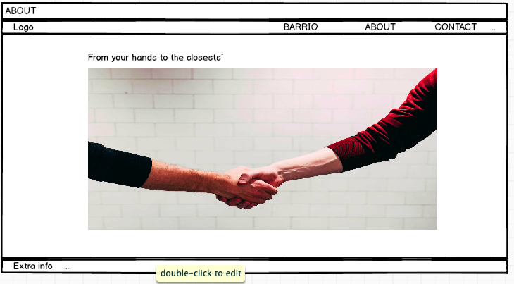

# Rails Assessment (A2-1) - Coder Academy, April 2019
## Juan Manuel Sanchez-Ortiz & Clementine Oldfield

Github Link:
https://github.com/ClementineOldfield/barrio-rails-app

## Setup instructions

TODO: Instructions

## Project Outline
```
You are to design, build, deploy and present a Ruby on Rails application (App).

You must build a two sided marketplace. This App will cater to two markets that your app brings together. For example,

- Ebay with buyers & sellers
- AirBnB with travellers & house owners
- Uber with travellers & drivers
```

---
<!-- 
Description of your project, including,
Problem definition / purpose
-->
## Problem definition / Purpose


#### 1. What is the need (i.e. challenge) that you will be addressing in your project?

We were tasked to create a two-sided marketplace as an assessment for Coder Academy´s second term.

The product was to incorporate authentication and authorisation systems, file uploading capability (images),a payment system, and the appropriate gems. It was then to be deployed to Heroku or AWS.

Working within the specifications provided, we decided to build a community focused, "Trading Post"-like application. 


#### 2. Identify the problem you’re trying to solve by building this particular marketplace App? Why is it a problem that needs solving?


Barrio (the Spanish word for Neighbourhood) aims to satisfy the very specific needs of locally established businesses & entrepreneurs that have a close set of customers whose needs are location-dependent. It aims to **increase their success opportunities**, therefore **encouraging entrepreneurship within the regular population** and **supporting local economy**.

Because *what is given to the citizens, returns to society*.

#### 3. Describe the project you will be conducting and how your App will address the needs.

We are developing a two-sided marketplace which will connect local businesses and potential customers, and we want it to **ensure an in person relationship** between them. That is the reason why a fundamental part of out application has to do with location, as the user is only shown the offers within a certain radius from their home address.

For this solution to be successful and useful, we plan to implement both the Google Maps Javascript API and the Geocoding API from Google. A map will output the nearest to the user offers, and the dashboard will display a list of them, also taking into account the launch date. Rails structure will be crucial for both objectives as well.

That way, the interested buyer will **easily meet the seller** in the address the latter has set up for that purpose.

Furthermore, each user will have their own profile page where they can share some information about themselves and the products they offer to the public. In addition, there will be an in-app messaging system, so that **buyer and seller can agree on the time and the manner** of completing the exchange. 

Everything will be carried out under the helpful knowledge that **payments will be done safely** with a third party service thanks to Stripe.

To allow the user to keep track of the products (listings) they are interested in and would like to access in the near future, we will implement a favourite option for each offer. The favourite listings will be accessible from the user's dashboard.

## Tech stack

- HTML5
- CSS3
- SCSS
- Ruby on Rails
- Puma

#### 4. Describe the network infrastructure the App may be based on.

Rails has a built in HTTP 1.1 server called Puma, which can be used to deploy locally or on the cloud. It is build for simplicity and speed, and is highly concurrent, so can handle a large amount of client requests at the same time in parallel.

After development, we will deploy the app on Heroku on the internet's Wide Area Network (WAN). Heroku is a cloud-based platform which provides a highly scalable infrastructure for developers to deploy applications built in Ruby, Java, Node.js, Scala, Clojure, Python, PHP, and Go. 

It uses Dynos (compartmentalized, completely independent, Linux "containers") for each application and also provides a database system. It supports Postgresql, which we will be using for our app, and integrates with a Github repository for each project which allows for version control provides automated application builds. 

#### 5. Identify and describe the software to be used in your App.

Barrio is built in [Ruby on Rails](https://rubyonrails.org/) as the framework. Rails is a web-application framework for Ruby that uses an MVC (Model, View, Controller) architectural structure to handle the communication between the data, logic and browser-rendered content.

Image upload will be handled by Rails' inbuilt ActiveStorage and stored on an AWS (Amazon Web Services) bucket. 

We use a Google Maps API to display the user's address based on longitude and latitude.

On completion, the app will be deployed on Heroku, which is a platform that allows developers to deploy, run and manage applications entirely on the cloud.

#### 6. Identify the database to be used in your App and provide a justification for your choice.

The database is Postgresql. An open-source SQL database. Rails integrates nicely with the database, allowing us to query it with Ruby, instead of writing SQL.

Postgresql also has recently added support for JSON, allowing it to integrate with NoSQL. This is something that we would be interested in looking into in future versions of the app.


## Functionality / features

lorem ipsum


# Design processes

## User stories

- As Georgie, I want to keep track of my neighbourhood products, to support local business.
- As Garret, I need a platform that will keep me informed of what is happening in my local community. 
- As Alfredo, I want an easy-to-use app so that my clients can easily pre-order what I sell.
- As Lucrecia, I want a transparent platform so that I can know more about local businesses and their philosophies.
- As Luke, I want a site to advertise my home-made jam.
- As Leah, I would like to buy fresh produce, eggs and milk as locally as possible.

## A workflow diagram of the user journey/s.

lorem ipsum

## Wireframes

### First iteration of wireframes on paper


## Database Entity Relationship Diagrams

lorem ipsum

# The Planning Process

## Database Design

### Initial ER Diagram


## Project Timeline

26th: Project idea approval

26th - 28th April: Wireframing & Design,  
Monday 29th April: Database planning and ERD

ERD approval

30th - 4th: Functionality,  
5th - 10th: Styling & Stretch Goals

Friday 10th May: App finished & Styled,  
11th & 12th: Bug fixing and finish documentation

### **Sunday, 12th of May: DUE @ 10pm**
-------

## Project Management
Screenshots of Trello board(s)


# Section 2.2 (Short Responses)


*7. Identify and describe the production database setup (i.e. postgres instance).* 


*8. Describe the architecture of your App.*

*9. Explain the different high-level components (abstractions) in your App.*

To answer this question we must know what a level of abstraction is in software. PC Magazine Encyclopedia defines it as "*[t]he amount of complexity by which a system is viewed or programmed. The higher the level, the less detail. The lower the level, the more detail. The highest level of abstraction is the entire system. The next level would be a handful of components, and so on, while the lowest level could be millions of objects*". 

To know more about abstractions, consult this [Stack Exchange post](https://softwareengineering.stackexchange.com/questions/110933/how-to-determine-the-levels-of-abstraction).

Taking all that into account, this question can be answered by speaking about MVC. We applied the MVC pattern as it is good practice in Ruby. Rails made it very easy to divide the code into models, controllers and views. If we have a look at [IBM documentation](https://www.ibm.com/support/knowledgecenter/en/SSZLC2_9.0.0/com.ibm.commerce.developer.doc/concepts/csdmvcdespat.htm):
..* Model: "*contains only the pure application data*" and "*no logic*".
..* View: "*knows how to access the model's data, but it does not know what this data means or what the user can do to manipulate it*".
..* Controller: "*listens to events triggered by the view (or another external source) and executes the appropriate reaction to these events*", mostly calling "*a method on the model*".

This pattern is possible due to the [relational mapping](https://docs.oracle.com/cd/E21764_01/web.1111/b32441/relmapun.htm#JITDG75011), which allows developers to work with Object Oriented Programmes while the program itself will convert the user inputs to SQL information. 

The technique of "*query and manipulate data from a database using an object-oriented paradigm*" is called [Object-Relational Mapping](https://stackoverflow.com/questions/1279613/what-is-an-orm-and-where-can-i-learn-more-about-it).

Herein something very important takes place: [persistency](https://hibernate.org/orm/what-is-an-orm/), which simply means that "*we would like our application’s data to outlive the applications process*". 

To achieve that persistency in Ruby on Rails, we are using [ActiveRecord](https://api.rubyonrails.org/classes/ActiveRecord/Base.html),which "*objects don't specify their attributes directly, but rather infer them from the table definition with which they're linked. Adding, removing, and changing attributes and their type is done directly in the database. Any change is instantly reflected in the Active Record objects. The mapping that binds a given Active Record class to a certain database table will happen automatically in most common cases, but can be overwritten for the uncommon ones*".

In addition, we use several Ruby Gems: Stripe, AWS, Devise, Font Awesome, Material Icons, Faker and Simple Form. All of them are detailed in question 10. More complex logic was abstracted out of the controller: AWS, Heroku, Stripe, Devise. They all are explained in question 10.

*10. Detail any third party services that your App will use.*
- Amazon Simple Storage Service (Amazon S3): this service makes web-scale computing easier thanks to its simple interface. Apparently, it gives access to the storage infrastructure Amazon benefits from.
- Google Maps Javascript API and Geocoding API from Google: the latter is a service which core function is turning addresses to coordinates (in latitude, longitude format). The former generates a dynamic map with one or more markers if necessary and depending on the developer´s requirements. Put along together an address can be taken from the user as an input, being this address turned into coordinates with Geocoding API and then marked in the map with Google Maps.
- Heroku: this cloud platform enables businesses to develop, configure, analyze, tune, manage and scale their projects. It is a polyglot platform because it supports Ruby (the obly one Heroky supported at its beginning), Node, Java, Scala, PHP and more.
- RubyGems: the gem is a self-contained format for Ruby programs and libraries to be distributed in, that can be installed and used in every project on a server. The package manager for Ruby is called RubyGems.
  Each gem is composed of code (test included), 
documentation, and gemspec.
  The gems we have used for Barrio are:
  1. [Stripe](https://github.com/stripe/stripe-ruby): allows individuals and businesses to make and receive payments over the Internet.
  2. [AWS S3](https://github.com/aws/aws-sdk-ruby): 
  3. [Devise](https://github.com/plataformatec/devise): an authentication service, presented as a MVC solution and on Rails.
  4. [Font Awesome](https://github.com/bokmann/font-awesome-rails): makes it easier to include [Font Awesome](https://fontawesome.com) icons.
  5. [Material Icons](https://github.com/Angelmmiguel/material_icons): helps add [Material Design Icons](https://google.github.io/material-design-icons/)´ set to a Rails project.
  6. [Faker](https://github.com/stympy/faker): provides coders with loans of data with which populate a database. It is helpful for testing, and that is what we used it for.
  7. [Simple Form](https://github.com/plataformatec/simple_form): Its main goal is to make it easier for coders to build forms. We used it for the search functionality.
- [Font Awesome](https://fontawesome.com): a website dedicated to sharing stock iconography.
- axios: Although it is also a [gem](https://github.com/axios/axios), we implemented it using cdn. It is necessary to get the coordinates information within the Geocode API of Google.

*11. Describe (in general terms) the data structure of marketplace apps that are similar to your own (e.g. eBay, Airbnb). Discuss the database relations to be implemented.*

We realize data is a key point within any ecommerce while reading [McKinsey Digital insights](https://www.mckinsey.com/business-functions/digital-mckinsey/our-insights/creating-a-successful-internet-of-things-data-marketplace): “*Digital marketplaces are platforms that connect providers and consumers of data sets and data streams, ensuring high quality, consistency, and security*”. 

On the other hand, a good criteria of differentiating among marketplaces can be whether they hold a centralized structure or a decentralized one. 

According to [Simon Rothman](https://techcrunch.com/2012/08/19/how-to-structure-a-marketplace/), of Greylock Partners: “*the more fundamental question is centralization vs decentralization*”. “*[D]oes the user do the work or does the platform do the work?*”, the author asks.

An ecommerce is decentralized if the user is entitled to and responsible for carrying the majority of the steps in the usage of the site. Eg: uploading pictures, writing reviews, etc.

As in Barrio most of the features depend on the user´s input, we can state that is a mainly decentralized site. The only features being centralized are payments and customer service. This “gives you speed, but the cost is an inconsistent and possibly poor user experience” (Rothman).

Another criterion to split marketplaces is given by Jonathan Golden, for whom Barrio would be a “search marketplace, where the guest selects where they will stay, choosing what to “purchase” in the marketplace”. It is different from a matching Marketplace in that the latter would connect buyer and seller through an algorithm.

Taking into account those two criteria, two similar marketplaces are eBay and Gumtree.

They both have users which can either buy or sell products no matter who the manufacturer is. In the case of eBay, from [February 2017](https://pages.ebay.com/sellerinformation/news/fallupdate16/structured-data.html), almost every new listing “*of new or manufacturer refurbished items in most categories […] require[s] at least one of the product identifiers*”. Therefore, the options “Does not Apply” and “NA” disappeared.

That way, eBay makes it easier for users to find what they want to buy as well as delivers a more relevant information so that they make the best purchase decision. From the perspective of a developer, the database structure might include a many-to-many relationship between a listings table and a categories(/identifier) table, as each listing may have some (zero or more) categories, and within each category there might be more than one (one or more) listings.

Regarding eBay´s data structure, it contains 6 ways to find an ítem: product pages, left navigation, category pages, eBay deal, search on eBay, and product reviews. To know more about eBay, visit [their webpage](https://pages.ebay.com/seller-center/seller-updates/2019-spring/marketplace-updates.html).


Although eBay has "only" 9 categories, it has a lot of subcategories so the search by that parameter might be more precise. eBay allows user to search by brand and interest as well. 

Gumtree, on the other side, takes into account the location of the user, in addition to a maximum distance, to display near offers. Also, it has 12 categories to tag its listings so far.

Barrio, in a more developed state, will allow their users to see the closest offers to their address. Thus it seems to be more similar to Gumtree. 

Both eBay and Gumtree (and so does Barrio) have a favorite or “add to watch list” option, and, as almost every other site, Contact and About pages.

To sum up, decentralized, searching digital marketplaces´ core functionalities are:
-	Sign in/up, authentication and authorisation.
-	A list creation and edition options.
-	Search engine.
-	Categories to tag products and filter searches.
-	A list of the products that are of interest to the user (watch list).
-	Payment system.
-	Contact options: for customer support.
-	About page.

Another one-step-further feature we didn´t speak about would be mail alerts and notifications: very important for marketing and sales purposes.

To finish with, Barrio ideally would have a reviews system, more often present in centralized sites like Amazon.


*12. Describe your project’s models in terms of the relationships (active record associations) they have with each other.*

For the user to address relationship, we had to decide between a 'one-to-one' relationship or a 'one-to-many' to allow for multiple users to live at the same address. We decided to go with a one-to-one, possibly creating duplicate addresses, to avoid any issues if/when the user decided to change their address.

*13. Provide your database schema design.*

*14. Provide User stories for your App.*

While declaring our User stories, we beared in mind that they are end-goals expressed in plain language and followed [Atlassian´s template](https://www.atlassian.com/agile/project-management/user-stories): "*As a [persona], I [want to], [so that].*".

1. "As a user I want to be able to upload profile images and featured images for my listings so that I can make my profile and listings more personal and attractive".

2. "As a user I want to be able to edit my profile so that I can keep it updated".

3. "As a user I would like to be able to navigate the app in a user friendly way so that I take the most of the app".

4. "As a user I would like to filter listings by category so that my offers can be easily found".

5. "As a user I need to be able to pay for items and accept payments so that I can buy and sell things online".

6. "As a user I would like to stay up to date with my local community so that I can feel I am part of it".

7. "As a User I need to be able to create and manage my own listings so that I can sell what I produce.".

8. "As a user, I would like to be notified when something important happens so that I am up to date regarding whatever affects me".

9. "As a user I would like to be able to message and receive messages from other users so that I can deal with potential customers".

*15. Provide Wireframes for your App.*

We did a pen and paper first version and a more accurate one with [Balsamiq](https://balsamiq.com).





*16. Describe the way tasks are allocated and tracked in your project.*

As we followed an Agile methodology, our main needs were teamwork and frequent inspection. Therefore, communication was a key part of the project. That is why we consantly talked through [Slack](https://slack.com/intl/es-es/) when wwe were outside the workplace.

Brainstorming and ERDs design were done by the two of us. As a digression, when we designed the ERD diagram, we used [draw.io](https://www.draw.io), which enabled us to work on the same file at a time and upload it to Google Drive.

For both to know what we had to do, we used several [Trello](https://trello.com) Boards. The first one we created was the Tasks one, so we could have a "to-do list" for general requirements affecting all the project, like "Propose different ideas" or "Wireframing in Balsamiq".


From the first cards of that board, we generated a Brainstorming one, so we could store all our ideas and check them at any time.


However, the part we have been working on the most are the Sprints, a clear application of the Agile methodology (and Scrum submethodology).


First, we decided which features had to be implemented first. Then, each day we allocated them depending on what each of us was more comfortable with and the relevance of each task regarding the project as a whole.

*17. Discuss how Agile methodology is being implemented in your project.*
To approach a project through an Agile methodology we must take into account the [Agile Manifesto](http://agilemanifesto.org), whose main statements are: 

- "**Individuals and interactions** over processes and tools".
- "**Working software** over comprehensive documentation".
- "**Customer collaboration** over contract negotiation".
- "**Responding to change** over following a plan".

Therefore, the [fundamental features](https://www.cprime.com/resources/what-is-agile-what-is-scrum/) of a methodology based on an iterative development such as Agile are: "frequent inspection and adaptation, a leadership philosophy that encourages teamwork, self-organization and accountability, a set of engineering best practices intended to allow for rapid delivery of high-quality software, and a business approach that aligns development with customer needs and company goals".

According to [Atlassian](https://www.atlassian.com/agile/project-management/user-stories), **user stories** are "*one of the core components of an agile program*" and "*provide a user-focused framework for daily work*". As it was shown in answer to question 14, we have used this non-technical tool to make ourselves aware of why we are developing Barrio. Thus, user stories were not only the first step, but also the guide-line, for us to approach our Rails assessment.

User stories behaved as the header of a specific Sprint Trello card, within which the needed tasks were enumerated and allocated. **The ERD was designed by the whole group**, so everyone knew how the app database was going to behave. However, this was **not a problem** for us **to change** the tables relationships if we needed to, having discussed it previosly.

The division in Sprints is another clear application of Agile methodology. A "*‘[sprint](https://www.sinnaps.com/en/project-management-blog agile-project-management-sprint-methodology#sprint-methodology)’ refers to a set period of time during which a certain task or activity is completed and then reviewed*". It is an essential tool in [Scrum submethodology](https://www.atlassian.com/agile/scrum/sprints).

Each day, we would **ask each other how we felt and what were our individual and collective goals for the day**. In addition, **every time one of us started or finished** a task would tell the other, **and each moment an issue showed up** we would have a **team talk** in order to fix it and solve any doubts, even sometimes new approaches were suggested and discussed. Thus, duplicities were avoided and obstacles were overcame.

Another way of being aware of what the other part of the team was doing would be **constantly pushing to GitHub with meaningful commitment messages**, merging and pulling. We also **sat together** al the time so we could **support** each other and **ask** anything easily. 

Furtermore, we also did **stand-up sessions** to say out loud our feelings and daily goals and, when working out of the workplace, and during weekends, we would use **Slack to keep in contact**.

To finish with, we did a quick, efficient google search for every function we didn´t know how to approach at first. After that, a new discussion would take place and what the group decided would be done. That way, we included some gems and APIs to the project.

*18. Provide an overview and description of your Source control process.*

*19. Provide an overview and description of your Testing process.*

*20. Discuss and analyse requirements related to information system security.*

*21. Discuss methods you will use to protect information and data.*

*22. Research what your legal obligations are in relation to handling user data.*

For a project like this to be legally assessed, several topics must be taken into account. The first one, though, very important these days, is the personal information security. It requires certain measures used to avoid any loss of integrity, compromise or unavailability of information generated by an entity or individual not meant to be publicly available.

Personal information is defined in Section 6 of the Privacy Act as “information or an opinion about an identified individual, or an individual who is reasonably identifiable”. 

It is necessary to empathize that the information or opinion doesn´t need to be true, nor recorded in a material form.

This concept indeed includes a person´s name, address, photos an information about what an individual likes, details all of them which Barrio obtains from their users, although the platform doesn´t show any other user´s favorite listings. Moreover, according to 6(1) Australian Privacy Principle, an entity holds personal information “if the entity has possession or control of a record that contains the personal information”.

That´s why Barrio needs to deal with personal information security regulations. Those mainly consist of the Privacy Act 1988 (and its ammendments) and the 13 Australian Privacy Principles (APPs) included in the former. As a result of that, Barrio is also regulated under the Notifiable Data Breach (NDB) scheme. To look up further which other legal bodies must be accomplished by Barrio, see Appendix B of the Guide to securing personal information of June 2018 (The Guide).

Luckily, we don´t deal with any sensitive information (see 6(1) APP), which would imply a stricter level of legal commitment.

To start with which legal obligations we have in relation to handling user information, we will have a look at the information lifecycle.

Personal information security throughout the lifecycle involves, according to The Guide:

1. “considering whether it is actually necessary to collect and hold personal information in order to carry out your functions or activities”

With regards to this question, we believe the email is the least intrusive way of logging in, rather than the mobile phone number. Furthermore, we want to ensure a minimum authentication, so it wouldn´t be enough to ask only for name and last name.
   
Furthermore, name (first and last) is required to address our local, personal, closer contact promoter, aim. 

Finally, address is needed so that nearby offers can be shown to the user.
    
2. “planning how personal information will be handled by embedding privacy protections into the design of information handling practices”.

Herein must be taken into account the so-called by the Office of the Australian Information Commissioner (OAIC), “privacy by design”. This implies incorporate privacy matters through the business plan, being the goals: avoid misuse, interference, loss or unauthorized accessing, modification or disclosure of personal information; detect privacy breaches, and respond to them in a timely manner. 

3. “assessing the risks associated with the collection of the personal information due to a new act, practice, change to an existing project or as part of business as usual”.

We plan to prepare a privacy impact assessment (PIA) following the Guide to undertaking privacy impact assessments of May 2014 (The Privacy Guide). As this document says: 

A privacy impact assessment is a systematic assessment of a project that identifies the impact that the project might have on the privacy of individuals, and sets out recommendations for managing, minimizing or eliminating that impact.

The PIA will consist of a description of the personal information flows, the analysis of the possible privacy impacts of those flows, an assessment of that impact on individuals, and an explanation of how those impacts will be eliminated or minimized.

The PIA will be done along with an information security risk assessment (or threat risk assessment), and both of them will be put into practice all across the business.

4. “taking appropriate steps and putting into place strategies to protect personal information that you hold".

Different approaches will be aimed:
-	Corporative culture: appropriate training and management to foster privacy and security, with clear procedures and lines of authority. 
-	Internal procedures: every practice regarding information security will be documented. Eg: PIA.
-	ICT security: 
Operation and effectivity of ICT (both software and hardware) security measures will be regularly monitored to ensure they remain responsive to changing threats. Specially, users´ password will be encrypted. 
Moreover, tests will be carried out not only during the ICT systems development, but regularly as well, and we will do regular back-ups.
To finish with, email communication with users won´t include any personal information.
-	Access security: we implemented a password system as to authenticate each user. They will be complex enough not to be guessable by other people. In addition, each user can change  or delete their information from the account and the profile settings menu. 
-	Third party providers: 
As we are using AWS services, we will make easy to access their privacy policy, which can be consulted here: https://aws.amazon.com/privacy/?nc1=h_ls.

-	Information hostage: if the information obtained from the user is no longer needed, we will proceed to erase it all. Also, procedures about how to act in data breach events will be documented.

To finish with, we will be also ruled by ISO/IEC 27000 series of information security.

5. “destruction or de-identification of the personal information when it is no longer needed”.
